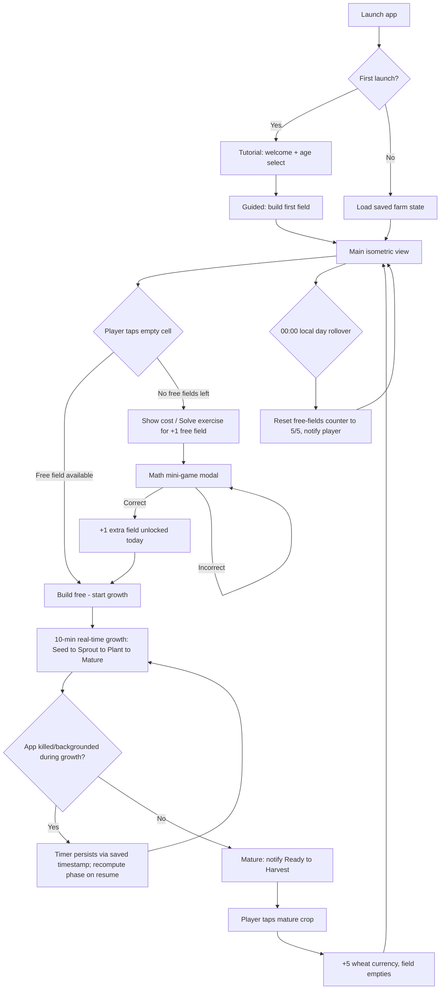

# Farm Math Builder — MVP Business Requirements Document (Weeks 1–4)

**Status:** Draft v1.0
**Author:** Business Analyst (AI-assisted)
**Date:** 2026-08-08
**Source:** `docs/raw-spec.md` (unrefined founder spec, Spanish, with decided-answers header)
**Scope of this document:** Weeks 1–4 MVP only, as defined in raw-spec.md §12. MVP+1 (Weeks 5–8) and v1.0 (Weeks 9–12) are referenced only to mark explicit exclusions.

---

## 1. Business Objectives / Problem Statement

### 1.1 Why this exists
Parents and educators want engaging screen time for kids aged 6–12 that reinforces basic arithmetic (addition, later subtraction/multiplication) without feeling like homework. Existing "edutainment" math apps tend to be either:
- Pure drill-and-practice (flashcards, timed quizzes) with weak intrinsic motivation, or
- Pure entertainment farm/city-builder games (FarmVille-style) with no educational content.

Farm Math Builder's hypothesis: **gating farm-building progression behind correct arithmetic answers** creates a self-reinforcing loop — kids want to expand their farm, and the only way to unlock extra capacity beyond the daily free allowance is to solve math problems. The game itself (grid building, crop growth, harvest, decoration) is the primary retention driver; the math is the "toll booth" to get more of it.

### 1.2 Who it's for
- **Primary user:** children 6–12, split into two difficulty/UX bands (6–9 and 10–12) selected at onboarding.
- **Secondary stakeholder:** parents, who care about (a) educational value, (b) no monetization/ads pressure, (c) no predatory engagement mechanics, (d) offline-safe (no always-online requirement, no chat/multiplayer exposure).
- **Business owner:** the founder/user, who wants a working, own-able product — not a reskin — and has explicitly accepted a 4-week timeline to build custom low-poly 3D art rather than compress scope.

### 1.3 Why now / cost of doing nothing
This is a net-new solo/small-team project; there is no existing product to protect or migrate. The BRD exists to convert an unrefined, mixed-language, partially self-contradictory spec into requirements a single developer can implement without re-deriving intent mid-build, and to surface ambiguities (Section 6) before Unity/C# work starts, since some of them (grid topology, save-schema fields, native-shell vs. pure-Unity architecture) are expensive to reverse once code is written against them.

### 1.4 MVP success criteria (proposed — confirm with founder/Product Owner)
- A single player can, in one offline session: select an age band → complete tutorial → build a wheat field → watch it grow (10 real-time minutes) → harvest → spend/save currency → hit the 5-free-fields/day cap → solve a math exercise to unlock an extra field → close and reopen the app with state intact.
- No crash or data loss when the app is backgrounded or killed mid-growth-timer.
- Build runs on min SDK Android 8.0 (API 26) devices without major performance degradation.

---

## 2. Scope

### 2.1 In scope (Weeks 1–4, per raw-spec.md §12)
- Grid-based build system, single starter crop (wheat)
- 10-minute real-time growth cycle
- Harvest + inventory (wheat currency)
- 5 free daily fields, resetting once per day
- Addition-only math mini-game (no subtraction yet), difficulty scaled by age band
- SQLite local persistence
- Tutorial / onboarding flow
- Basic path placement (decorative, unlocked per new field) — see note in 2.3
- Basic settings/accessibility (age selector, volume, text size, high contrast, no-notifications mode)

### 2.2 Out of scope for this MVP phase
See Section 5 for full list and rationale (subtraction, multiple difficulty levels beyond the age-band split, notifications, achievements/badges, second crop, XP/leveling, cloud sync, multiplayer, monetization, iOS).

### 2.3 Scope note — paths (§2.4 of raw spec)
Raw-spec.md places "Sistema de Caminos" in §2.4 (core mechanics) but the Week 1–4 roadmap line (§12) does not list paths among the seven named MVP deliverables — paths are explicitly listed under **MVP+1** ("caminos + decoracion"). This is a direct contradiction inside the source document.
**Resolution proposed in this BRD:** treat paths as **Should**, not **Must**, for Weeks 1–4 (include if capacity allows after the seven core items are done and stable), and flag this to the founder for an explicit decision (see Risk R-1). Functional requirements for paths are still written below so the developer isn't blocked if the founder confirms "in."

### 2.4 In-scope vs out-of-scope table

| Item | In MVP (Wk 1-4)? | Source |
|---|---|---|
| Square or hex grid, 6x8, central non-editable farm building | Yes | §2.1 |
| Wheat crop, 4 growth phases, 10-min real timer | Yes | §2.2 |
| Harvest action, +5 currency | Yes | §2.2 |
| 5 free fields/day, daily reset | Yes | §2.2, §3.1 |
| Extra field per correct math answer | Yes | §2.3 |
| Addition mini-game, difficulty by age band | Yes | §5.1 (addition only; subtraction is MVP+1 per §12) |
| Cancel-growth / undo-to-seed | Yes | §2.5 |
| SQLite persistence, 5-min auto-backup | Yes | §6 |
| Tutorial flow | Yes | §8 |
| Age selector, volume/text/contrast settings | Yes | §9 |
| Paths (decorative) | Should (contradiction — see 2.3) | §2.4 / §12 conflict |
| Weekly harvest tracker + badge | No — MVP+1 candidate, not in §12 list | §3.2 |
| Farm levels / XP | No — explicitly "Futuro" | §3.3 |
| Subtraction, difficulty tiers beyond age band | No — MVP+1 | §12 |
| Local push notifications | No — MVP+1 ("opcional") | §4.4 |
| Second crop (corn), cloud sync, multiplayer, iOS | No — v1.0 | §12 |
| Monetization (ads, IAP, cosmetics) | No — explicitly excluded, "never pay-to-win" | §10 |

---

## 3. Stakeholders & Roles

| Role | Description |
|---|---|
| Founder / Product Owner | Owns product vision, prioritization, final scope calls |
| Solo developer (Unity/C#) | Builds the game; consumer of this BRD |
| Player (child, 6-9 or 10-12) | Primary end user |
| Parent/guardian | Installs app, indirect stakeholder for trust/safety and educational value |

---

## 4. As-Is / To-Be Note

There is no as-is process — this is a greenfield product. A to-be core loop diagram is provided instead to ground the functional requirements.

---

## 5. Functional Requirements

Requirements are grouped by the spec's existing sections. Each has a unique ID, description, and proposed MoSCoW tag for the Product Owner to confirm/adjust.

### 5.1 Grid & Construction (raw-spec §2.1)

| ID | Requirement | MoSCoW | Source |
|---|---|---|---|
| FR-001 | The system shall present a farm map divided into a fixed grid of cells (initial size 6x8), with cell shape (square or hex) as a single confirmed decision applied consistently across the MVP (see Risk R-2). | Must | §2.1 |
| FR-002 | The system shall designate one central cell as the main farm building, which cannot be edited, removed, or built over. | Must | §2.1 |
| FR-003 | The system shall enforce exactly one occupant per cell; a cell already occupied cannot accept a second construction. | Must | §2.1 |
| FR-004 | The system shall visually distinguish three cell states at all times: available (buildable), occupied, and locked (outside current buildable radius). | Must | §2.1 |
| FR-005 | The system shall define a buildable radius around the central building and visually indicate it to the player. | Must | §2.1 |
| FR-006 | The system shall allow destructible objects (wheat fields, paths) to be removed and rebuilt without any currency cost. | Must | §2.1 |
| FR-007 | The system shall support pinch-to-zoom (two-finger) and drag-to-pan touch gestures on the main farm view. | Must | §4.1 |

### 5.2 Crop Growth Cycle (raw-spec §2.2)

| ID | Requirement | MoSCoW | Source |
|---|---|---|---|
| FR-010 | The system shall support one crop type in MVP: Wheat. | Must | §2.2, §12 |
| FR-011 | A planted wheat field shall progress through exactly four visual growth phases in order: Seed, Sprout, Plant, Mature. | Must | §2.2 |
| FR-012 | The full Seed-to-Mature cycle shall take 10 real-world minutes, measured by wall-clock elapsed time (not app-foreground time only). | Must | §2.2 |
| FR-013 | Each growth phase transition shall be represented by a progressive growth animation, not an instant visual swap. | Must | §2.2 |
| FR-014 | Upon reaching Mature, the system shall trigger a visual and audio notification and display a "Ready to Harvest" popup/indicator. | Must | §2.2 |
| FR-015 | Tapping a Mature crop shall execute the harvest action: award +5 wheat currency and return the cell to an empty, plantable state. | Must | §2.2 |
| FR-016 | The system shall track free-field usage against a daily cap of 5 free wheat plantings (see FR-030 for reset rule). | Must | §2.2, §3.1 |
| FR-017 | Growth timers shall survive app backgrounding and full process kill: on resume, the system shall recompute current growth phase from the stored plant timestamp, not from elapsed foreground time. | Must | Derived from §2.2 + §11 (WorkManager/Handler) |

### 5.3 Currency & Unlock Economy (raw-spec §2.3)

| ID | Requirement | MoSCoW | Source |
|---|---|---|---|
| FR-020 | The system shall maintain a single currency, Wheat, incremented only by harvest actions (+5 per harvest). | Must | §2.3 |
| FR-021 | Wheat currency shall be spendable only to unlock additional daily free fields beyond the base 5; no other sink exists in MVP. | Must | §2.3 |
| FR-022 | The system shall NOT offer any real-money purchase path for currency or fields in MVP. | Must | §2.3, §10 |
| FR-023 | Each correctly answered math exercise shall grant +1 extra field-of-the-day, additive to (not replacing) the 5 free daily fields. | Must | §2.3 |
| FR-024 | Math exercises shall be accessible at any time via a floating action button / in-game menu, without leaving the main farm view (modal overlay). | Must | §2.3, §5.1 |
| FR-025 | The system shall display a running counter of extra fields earned today in the format "Extra fields available today: X/Y" where Y is uncapped-in-spirit but must show a concrete running total (see Risk R-3 on whether Y=10 is a hard cap). | Must | §2.3 |
| FR-026 | Players shall be able to answer math exercises an unlimited number of times per day, with no session limit. | Must | §2.3 |

### 5.4 Path System (raw-spec §2.4) — tagged Should, see Section 2.3

| ID | Requirement | MoSCoW | Source |
|---|---|---|---|
| FR-030 | Path segments (straight, corner, intersection — minimum 3 types) shall unlock progressively, one new type/instance made available each time the player completes a new wheat field. | Should | §2.4 |
| FR-031 | Placing a path shall require only a tap on an eligible cell (no currency cost, no confirmation friction). | Should | §2.4 |
| FR-032 | Paths shall be placeable only on cells within the current buildable radius, subject to the same one-occupant-per-cell rule as FR-003. | Should | §2.4 |

### 5.5 Construction Interruption (raw-spec §2.5)

| ID | Requirement | MoSCoW | Source |
|---|---|---|---|
| FR-040 | While a field is growing (Seed/Sprout/Plant, not yet Mature), tapping it shall present a "Cancel Growth" option. | Must | §2.5 |
| FR-041 | Confirming cancel shall revert the cell to empty, refund any resources consumed at plant time (if planting had a cost — see FR-021/FR-023 interaction), and NOT count against or restore the daily free-field counter (see Risk R-4 — spec is silent on whether cancel refunds the daily-cap slot). | Must | §2.5 |
| FR-042 | The cancel affordance shall be visually indicated on growing crops (e.g., "X" icon or swipe gesture) and the cancel action shall play a shrink/fade-out animation. | Should | §2.5 |

### 5.6 Daily/Weekly Cycles (raw-spec §3.1–3.2)

| ID | Requirement | MoSCoW | Source |
|---|---|---|---|
| FR-050 | The system shall reset the free-fields counter to 5/5 once every 24-hour cycle, at a consistently defined rollover instant (see Risk R-5 — UTC vs. local time conflict). | Must | §3.1 |
| FR-051 | The main screen shall display a persistent counter "Free fields today: X/5". | Must | §3.1 |
| FR-052 | On daily reset, the system shall show a notification "5 new fields available" the next time the app is opened (or foregrounded) after rollover. | Must | §3.1 |
| FR-053 | Weekly harvest tracker and the "Harvest 20 fields" badge/medal reward are explicitly NOT required for MVP (§12 lists only the 7 named deliverables; §3.2 is not among them). | Won't (this phase) | §3.2 vs §12 |

### 5.7 Math Exercise Mini-Game (raw-spec §5)

| ID | Requirement | MoSCoW | Source |
|---|---|---|---|
| FR-060 | The math exercise shall present as a modal overlay that does not unload or reset the underlying farm view. | Must | §5.1 |
| FR-061 | Each exercise shall show one question and exactly 4 multiple-choice answer options. | Must | §5.1 |
| FR-062 | The system shall give immediate feedback (correct/incorrect) after each answer, with no penalty for incorrect answers and unlimited retry. | Must | §5.1 |
| FR-063 | For MVP, exercises shall be addition only (subtraction is MVP+1 per §12), using operand ranges scaled by age band: ages 6-9 -> operands 1-10; ages 10-12 -> operands 1-50. (Note: raw spec's three-tier Easy/Normal/Hard difficulty in §5.1 maps to age selection differently than the two-band decision in the header — see Risk R-6.) | Must | §5.1, §12 |
| FR-064 | The system shall track and display a running count of exercises solved today. | Should | §5.2 |
| FR-065 | The system shall track a streak of consecutive correct answers within a session. | Should | §5.2 |
| FR-066 | Correct answers shall trigger a positive feedback animation (e.g., confetti) per §4.4. | Should | §4.4, §5.2 |

### 5.8 Persistence (raw-spec §6)

| ID | Requirement | MoSCoW | Source |
|---|---|---|---|
| FR-070 | The system shall persist, per cell: occupant type and current growth phase/timestamp, using local SQLite (Room, if a native Android layer is used — see Risk R-7 on architecture). | Must | §6 |
| FR-071 | The system shall persist: wheat currency balance, free fields used today, extra fields earned today, last daily-reset timestamp, exercises solved count. | Must | §6 |
| FR-072 | The system shall auto-save/backup state after 5 minutes of user inactivity. | Must | §6 |
| FR-073 | The system shall also save state on app background/pause events (not only on the 5-minute inactivity timer), to protect against process kill between saves — this is a BA-added requirement to close a gap in the raw spec (see Risk R-8). | Must | Derived — gap-fill |
| FR-074 | Undo buffer is optional for MVP; if omitted, FR-041 (cancel growth) must still function using only the persisted plant timestamp, without a full undo history. | Could | §6 ("opcional") |
| FR-075 | Player level/XP fields shall NOT be part of the MVP save schema (they are "futuro" per §3.3/§6). | Won't (this phase) | §3.3, §6 |
| FR-076 | Cloud sync shall NOT be implemented; the local schema should avoid decisions that would require a breaking migration when cloud sync is added later, but building for it now is out of scope. | Must (constraint) / Won't (feature) | §6 |

### 5.9 Onboarding (raw-spec §8)

| ID | Requirement | MoSCoW | Source |
|---|---|---|---|
| FR-080 | On first launch, the system shall present: welcome screen, then age-band selection (6-9 or 10-12 — see Risk R-6 on the third "13+" option present in §8.1 but absent from the header decision). | Must | §8.1 |
| FR-081 | The tutorial shall guide the player through, in order: build first field -> wait for growth -> harvest -> solve an exercise -> free-form farm design. | Must | §8.1 |
| FR-082 | The tutorial shall use a pulsing highlight on the first buildable cell to draw attention. | Must | §8.2 |
| FR-083 | The tutorial shall show a tooltip "tap to harvest" at the appropriate step. | Must | §8.2 |
| FR-084 | The tutorial shall highlight all currently buildable cells during the guided build step. | Must | §8.2 |
| FR-085 | The tutorial shall not require the player to wait the full 10 real minutes to complete tutorial step "wait for growth" (see Risk R-9 — spec doesn't define a tutorial time-skip; without one, tutorial completion is blocked for 10 minutes on first launch). | Must (with BA-flagged gap) | Derived — gap-fill |

### 5.10 Accessibility & Settings (raw-spec §9)

| ID | Requirement | MoSCoW | Source |
|---|---|---|---|
| FR-090 | The system shall offer an age selector at startup that determines exercise difficulty (see FR-063). | Must | §9 |
| FR-091 | The system shall offer independent volume controls for music and SFX. | Must | §9 |
| FR-092 | The system shall offer a mute-all (no-sound) mode. | Must | §9 |
| FR-093 | The system shall offer configurable text size. | Should | §9 |
| FR-094 | The system shall offer a high-contrast display mode. | Should | §9 |
| FR-095 | The system shall offer a no-notifications mode (relevant mainly once local notifications ship in MVP+1, but the toggle and its persisted state should exist in MVP so it's not a breaking settings-schema change later). | Should | §9 |

---

## 6. Business Rules

Business rules are separated from requirements below; each is referenced by ID from the functional requirements above.

| ID | Rule | Referenced by |
|---|---|---|
| BR-001 | A cell may hold at most one occupant (crop, path, or the central building) at any time. | FR-003, FR-032 |
| BR-002 | The central farm-building cell is permanently non-editable. | FR-002 |
| BR-003 | Harvesting a Mature wheat field always yields exactly +5 wheat currency. | FR-015, FR-020 |
| BR-004 | A player may plant into a free-field slot only if free fields used today < (5 + extra fields earned today). | FR-016, FR-023, FR-025 |
| BR-005 | One correct math answer always yields exactly +1 extra field-of-the-day; incorrect answers yield 0 and carry no penalty. | FR-023, FR-062 |
| BR-006 | The daily free-field counter and extra-field counter both reset to their base state (5 free / 0 extra) once per rollover, per the reset-time rule in R-5. | FR-050 |
| BR-007 | Destructible objects (fields, paths) may be removed and rebuilt at zero currency cost, unlimited times. | FR-006 |
| BR-008 | Exercise difficulty (operand range) is determined solely by the age band selected at onboarding; it does not change dynamically based on performance in MVP. | FR-063 |
| BR-009 | No feature in MVP may accept real-money payment. | FR-022 |

Decision-table candidate — **field availability at build attempt** (3+ conditions, per BA technique guidance):

| Free fields used < 5? | Extra fields earned today > extra fields used today? | Result |
|---|---|---|
| Yes | — | Build free, consume a free-field slot |
| No | Yes | Build free, consume an extra-field slot |
| No | No | Show cost/"solve exercise for +1 field" prompt (FR-024) |

---

## 7. Data Requirements (Mini Data Dictionary)

| Entity.Field | Type | Source | Validation / Notes |
|---|---|---|---|
| Cell.id | int/coord pair | System-generated | Unique per grid position; immutable |
| Cell.occupantType | enum (Empty, Wheat, Path, Building) | System | Must be one of defined enum values |
| Cell.growthPhase | enum (Seed, Sprout, Plant, Mature) | System | Only valid when occupantType = Wheat |
| Cell.plantedAtTimestamp | UTC datetime | System (on plant action) | Used to derive growth phase on resume (FR-017) |
| Player.wheatCurrency | int, >= 0 | System | Incremented by harvest (+5), never negative |
| Player.freeFieldsUsedToday | int, 0-5+ | System | Reset per BR-006 |
| Player.extraFieldsEarnedToday | int, >= 0 | System | Incremented per correct exercise answer |
| Player.extraFieldsUsedToday | int, >= 0 | System | Must not exceed extraFieldsEarnedToday |
| Player.lastDailyResetTimestamp | UTC datetime | System | Compared against current time to trigger BR-006 |
| Player.ageBand | enum (6-9, 10-12) | User input at onboarding | Set once at onboarding; mutability post-onboarding TBD (see Risk R-10) |
| Player.exercisesSolvedToday | int, >= 0 | System | Display-only counter (FR-064) |
| Player.currentStreak | int, >= 0 | System | Resets to 0 on incorrect answer (FR-065) |
| Settings.musicVolume | float 0.0-1.0 | User input | |
| Settings.sfxVolume | float 0.0-1.0 | User input | |
| Settings.muted | bool | User input | |
| Settings.textSize | enum (Small, Medium, Large) | User input | |
| Settings.highContrast | bool | User input | |
| Settings.notificationsEnabled | bool | User input | Toggle exists in MVP even though feature ships MVP+1 (FR-095) |
| Exercise.operandA, operandB | int | System-generated, range by ageBand | Per FR-063 ranges |
| Exercise.correctAnswer | int | System-computed | |
| Exercise.choices | int[4] | System-generated | One correct + 3 distractors, no duplicates |

---

## 8. Non-Functional Requirements

| ID | Requirement | Notes |
|---|---|---|
| NFR-001 | Growth timers (FR-012, FR-017) shall be accurate to within +/-30 seconds of the true 10-minute duration even after an app kill/relaunch cycle, since phase is recomputed from a stored timestamp rather than a running in-memory clock. | Core reliability requirement — this is the single riskiest technical bet in the MVP |
| NFR-002 | The app shall be fully playable offline; no network call is required for any MVP feature. | Consistent with "local-only, no cloud sync" decision |
| NFR-003 | Min supported Android SDK: API 26 (Android 8.0). Target SDK: Android 14+ (per raw-spec §11). | |
| NFR-004 | The app shall not lose player progress (currency, cell states, daily counters) across an OS-initiated process kill while backgrounded. | Ties to FR-073 |
| NFR-005 | Local database writes (auto-save) shall not cause visible frame-rate hitches on the main isometric view (target: maintain interactive frame rate during a background save). | |
| NFR-006 | The math exercise modal shall load and be answerable within 1 second of tapping the FAB, with no network dependency. | |
| NFR-007 | All child-facing text/UI shall avoid reading-heavy instructions for the 6-9 band; prefer icons/audio cues over dense text (supports FR-082-084 tutorial design and the age split itself). | Derived from target-age constraint, not explicit in raw spec |
| NFR-008 | The app shall contain no third-party ad SDKs, analytics SDKs that transmit child PII, or in-app purchase hooks in the MVP build. | Supports COPPA-style caution given child audience; raw spec confirms no monetization in MVP but doesn't address data-privacy SDKs — flagged as Risk R-11 |
| NFR-009 | Build/target architecture shall support the 6x8 grid (48 cells) with acceptable load time (<3s cold start to interactive main view) on a low-to-mid tier Android 8.0 device. | |

---

## 9. Explicit Out-of-Scope for This MVP Phase

The following are confirmed by the founder's decisions or by raw-spec §12 to be excluded from Weeks 1-4, and should not be built now even opportunistically:

1. **Multiplayer** (local or online) — explicitly excluded for MVP by founder decision; also a v1.0 item in raw spec.
2. **Monetization** — no ads, no IAP, no premium cosmetics (raw-spec §10, explicit "NO INCLUIR AHORA").
3. **Cloud sync** — local SQLite only for MVP; cloud sync is a v1.0 item (raw-spec §6, §12).
4. **Second crop (corn/maiz)** — wheat only in MVP; corn is v1.0 (raw-spec §12).
5. **XP / farm leveling system** (§3.3) — explicitly marked "Futuro" in the raw spec itself.
6. **Push/local notifications** ("Tu trigo esta listo" after 6h offline) — raw-spec §4.4 marks this "opcional MVP+1."
7. **Subtraction and multi-tier difficulty beyond age band** — addition only in MVP; subtraction and richer difficulty tiers are MVP+1 (raw-spec §12).
8. **Weekly harvest tracker + achievement badge** (§3.2) — not among the 7 named MVP deliverables in §12.
9. **Achievements/badges system generally** — MVP+1 (raw-spec §12: "logros/badges").
10. **iOS build** — v1.0 item; MVP is Android-only.
11. **Improved charts/graphs** ("graficas mejoradas") — MVP+1.

Recommendation: keep this list visible in the backlog (product-owner agent) so nothing here is silently re-added mid-sprint via scope creep.

---

## 10. Assumptions

- A-1: "Age band" selected at onboarding (FR-080) determines exercise difficulty for the life of the save file unless the player explicitly changes it in Settings; changing it mid-game is assumed allowed but not required for MVP.
- A-2: The 6x8 grid size is fixed for MVP; "expandable" (mentioned in §2.1) is assumed to be a post-MVP capability, not required now.
- A-3: Sound/animation assets for "confetti" and growth-phase transitions can be simple/placeholder-quality without violating the founder's stated art-quality bar, which applies primarily to the 3D low-poly farm/crop models, not UI feedback effects.
- A-4: "Undo buffer (opcional)" in §6 refers to the same mechanism as the cancel-growth feature (§2.5), not a separate general undo-anything system; FR-074 is written on this assumption.
- A-5: One local save profile per device install is sufficient for MVP (no multi-child-profile switching on a shared device).

## 11. Constraints & Dependencies

- Engine: Unity, for the 3D low-poly isometric art style (founder-mandated).
- Persistence: SQLite/Room, local-only.
- Min SDK API 26 / Target SDK Android 14+.
- Single developer/small team — sequencing and estimate realism in downstream planning should account for this (flag to project-manager agent).
- Custom 3D low-poly art asset production (crop model x4 phases, building model, 4-6 path types, terrain textures, UI icons per raw-spec §7.2) is a hard dependency for a "real" build and was the reason the 1-week timeline was rejected in favor of 4 weeks.

---

## 12. Open Risks / Gaps (For Founder Resolution Before Development Starts)

These are contradictions, ambiguities, or silent gaps found in raw-spec.md. Recommend resolving R-1 through R-7 before Unity/C# work begins, since they affect grid topology, save schema, and app architecture — all expensive to change after code exists.

| ID | Risk / Gap | Where it shows up | Why it matters | Recommended next step |
|---|---|---|---|---|
| **R-1** | **Paths are simultaneously "core mechanic" (§2.4) and "MVP+1" (§12 roadmap line).** The MVP roadmap sentence in §12 lists 7 deliverables and paths are not among them, but §2.4 describes them in detail as part of core mechanics. | §2.4 vs §12 | Directly affects Week 1-4 scope and estimate; developer needs one answer, not two. | Founder confirms: paths in or out of Weeks 1-4. This BRD defaults to "Should" (nice-to-have, not launch-blocking). |
| **R-2** | **Grid topology undecided: hex vs. square.** §2.1 literally says "hexagonales o cuadradas" (or) — not a choice. | §2.1 | Hex and square grids have different neighbor math, different path-tile art (hex paths need 6-way pieces vs. 4-way), different central-building footprint logic. Cannot be prototyped both ways cheaply. | Founder picks one before any grid code is written. Square is the lower-risk/lower-art-cost default given the reference screenshot appears to use a square-ish isometric layout — confirm against `3dExample.png`. |
| **R-3** | **Is the "extra fields today" counter capped?** §2.3 shows an example UI string "Campos extra disponibles hoy: 3/10" implying a cap of 10, but the surrounding rule text says exercises can be solved "sin limite por sesion" (no session limit), implying uncapped extra-field earning. | §2.3 | If uncapped, the "X/10" UI format is wrong and needs a different display (e.g., just "+7 today"). If capped at 10, that's a business rule (BR) not yet stated as such, and FR-025/FR-026 partially conflict. | Founder confirms: is there a daily cap on exercise-earned fields, and if so what number? |
| **R-4** | **Does cancelling a growing crop (§2.5) restore/free up a daily free-field slot, or just refund resources?** Spec says "devuelve automaticamente los recursos... al inventario" but wheat has no planting cost stated elsewhere, so it's unclear what "resources" refers to, and whether the freeField/extraField slot consumed at plant time is returned. | §2.5 vs §2.2/§2.3 | Without this rule, a player could plant-cancel-replant to farm infinite free-field slots, or conversely be unfairly locked out after cancelling. Needs a BR before implementation. | Founder decides: cancel restores the slot (recommended, matches "no cost to destroy/rebuild" spirit of BR-007) or does not. |
| **R-5** | **Daily reset time: "00:00 UTC" (§3.1) vs. child-facing UX expectation of a local-time day boundary.** A 6-year-old in, say, US Eastern time resetting at 20:00 local (UTC-4) the previous evening, or at odd local hours depending on timezone, will be confusing ("why did my fields reset in the afternoon?"). | §3.1 | Directly named in the task brief as a flag-worthy gap. UTC reset is simpler to implement and test but works against the stated goal of "predictable cycles" for young kids if it doesn't align with their actual day. | Recommend switching to device-local midnight for MVP (simpler mental model for a 6-12 year old); confirm with founder — this is a one-line spec change now, a schema/logic change later. |
| **R-6** | **Age banding is inconsistent across sections.** Header decision says two bands (6-9, 10-12). §8.1 tutorial flow lists three options ("6-9, 10-12, 13+"). §5.1 describes three difficulty tiers (Facil/Normal/Dificil) that don't map 1:1 onto two age bands. | Header vs §8.1 vs §5.1 | Developer needs one consistent enum for Player.ageBand and one consistent difficulty-selection rule feeding FR-063. As written, three different sources of truth exist. | Founder confirms: exactly two age bands (per header decision, which overrides per the task brief), and confirms the operand ranges this BRD proposed in FR-063 (1-10 for 6-9, 1-50 for 10-12) are the addition-only MVP ranges — the "Dificil 1-100 + multiplicacion" tier in §5.1 is deferred (multiplication isn't in MVP scope per §12 either). |
| **R-7** | **Architecture: is there a native Android (Kotlin/Compose) shell around a Unity view, or does everything live in Unity/C#?** §11 raises this itself as an open question ("evaluar si Compose/ViewModel aplica solo a shell nativo o si todo vive en Unity/C#") but never resolves it, despite stating Kotlin, WorkManager, ViewModel/LiveData or Compose as constraints alongside "Motor: Unity (decidido)." | §11 | This is the single most consequential unresolved technical decision in the whole spec. It determines: where SQLite/Room lives (native layer vs. a C# SQLite plugin inside Unity), where the background timer (FR-017) is implemented (WorkManager needs a native process, not just a Unity coroutine, to reliably survive process death), and the whole project's tech stack split. Building this MVP without resolving it risks a rebuild. | Recommend for a solo developer building in Unity for the art pipeline: keep everything in Unity/C# (use a C# SQLite library, e.g. sqlite-net, and Unity's own lifecycle/PlayerPrefs+file-based persistence for timers) rather than maintaining a native Kotlin shell + Unity view + IPC bridge, which is a lot of extra complexity for one person. Founder should explicitly bless this simplification since raw-spec §11 names Kotlin/WorkManager/ViewModel as if a native layer is assumed. |
| R-8 | Spec doesn't explicitly say growth-timer state must be saved on app background/pause, only "backup automatico cada 5 min de inactividad" — a kill between saves could lose up to 5 minutes of a 10-minute timer's authoritative state, though since state is timestamp-based (not counter-based) this may be self-healing. Confirm the save model is timestamp-based (survives gaps) not tick-counter-based (loses ticks). | §6 | Affects NFR-001/NFR-004 reliability guarantee. | This BRD's FR-070/FR-073 assume timestamp-based recomputation, which sidesteps the risk — confirm developer implements it this way, not as a decrementing counter. |
| R-9 | Tutorial requires "esperar crecimiento" (wait for growth) as a literal step, but growth takes 10 real minutes — no tutorial fast-path/skip is defined, meaning a first-time player is blocked mid-onboarding for 10 minutes unless a dev-added shortcut exists. | §8.1 | Bad first-run UX; risks kids abandoning before ever reaching harvest. | Recommend a shortened tutorial-only growth timer (e.g., 30-60 seconds) for the first field only, then normal 10-minute timer for all subsequent fields. Needs founder sign-off since it deviates from the literal spec. |
| R-10 | Whether Player.ageBand is changeable after onboarding (e.g., via Settings) is unstated. | §8.1, §9 | Affects Settings screen scope and whether changing it mid-game should reset/preserve exercise history. | Low-priority; default to "not changeable in MVP" unless founder wants it, per Assumption A-1. |
| R-11 | Raw spec is silent on data-privacy/COPPA-style considerations despite targeting children under 13 (analytics SDKs, crash reporting that might collect device/child data). | Not covered in raw spec | Legal/trust exposure if any third-party SDK is added later without review, even though MVP itself has no monetization. | Recommend the founder get light legal/compliance guidance before any analytics or crash-reporting SDK is added, even post-MVP. NFR-008 added as a guardrail for now. |

---

## 13. Quality Checklist (self-review)

- [x] Each requirement has a unique ID (FR-xxx, BR-xxx, NFR-xxx) for traceability.
- [x] Requirements avoid solution language where possible (a few, e.g. FR-017/FR-073, necessarily reference WorkManager-style persistence because the raw spec itself names the technical constraint — flagged as derived/gap-fill rather than pure business requirement).
- [x] Exception/edge paths covered: cancel-growth mid-cycle (FR-040-042), app-kill during timer (FR-017, NFR-001/004), incorrect exercise answers (FR-062), no-free-fields-remaining state (FR-024, decision table in Section 6).
- [x] Acronyms/domain terms are defined inline (SDK, FAB, XP, COPPA-style note in R-11).
- [x] Assumptions (Section 10) and open questions (Section 12) are explicit, not silently resolved.
- [ ] **Not yet done — needs founder input:** R-1 through R-7 are blocking-before-build ambiguities; the rest are lower risk and can be resolved during Week 1.

---

## 14. Next Steps

1. **Founder decision pass** on Risks R-1 through R-7 (grid shape, paths in/out, extra-field cap, cancel-growth slot refund, reset timezone, age-band/difficulty mapping, native-shell-vs-pure-Unity architecture). These materially change FR wording and estimates.
2. **product-owner agent**: take the MoSCoW tags in Section 5 and the in/out-of-scope table (Section 2.4) and produce a prioritized Week 1-4 backlog/sprint plan, splitting FRs into stories sized for a solo developer.
3. **qa-tester agent**: review this BRD for testability, especially NFR-001 (timer accuracy across process kill) and the decision table in Section 6, and produce a test plan before FR-010 through FR-017 (the crop cycle — the riskiest technical bet) are implemented.
4. Optionally, **project-manager agent**: turn the 7 core MVP deliverables + open risks into a Week 1-4 plan/RAID log, given this is a solo/small-team effort.

